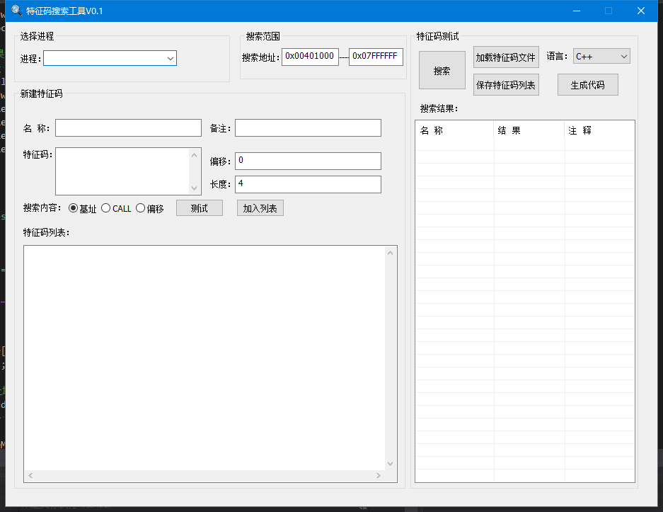
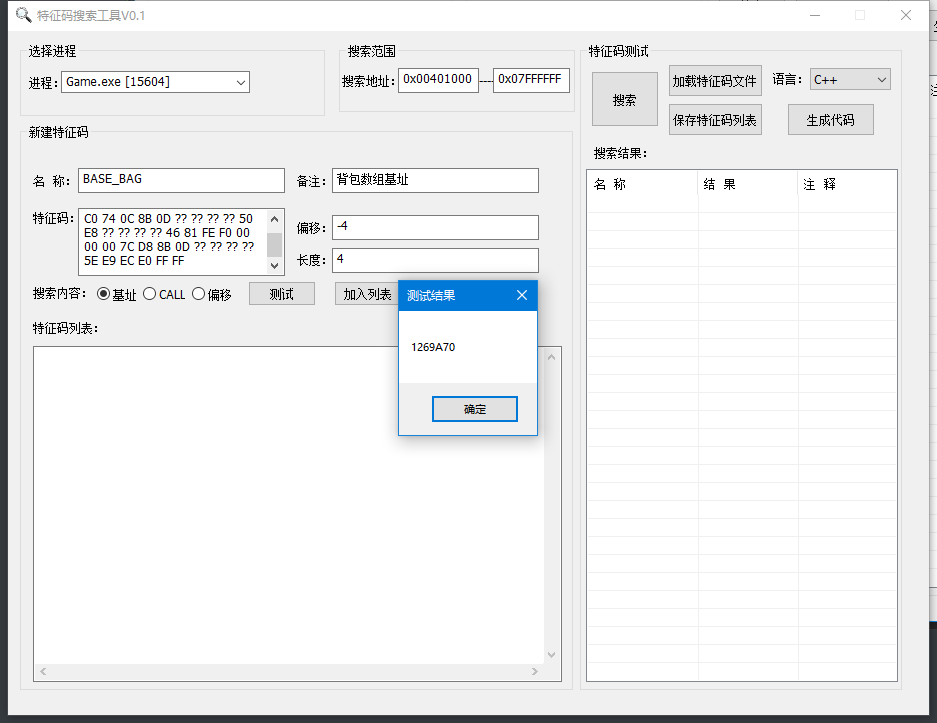
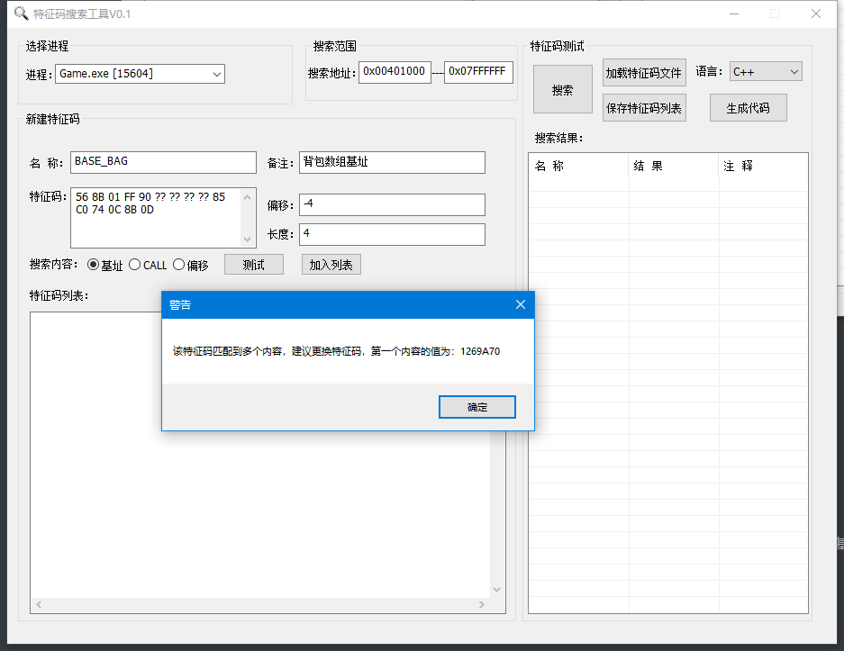
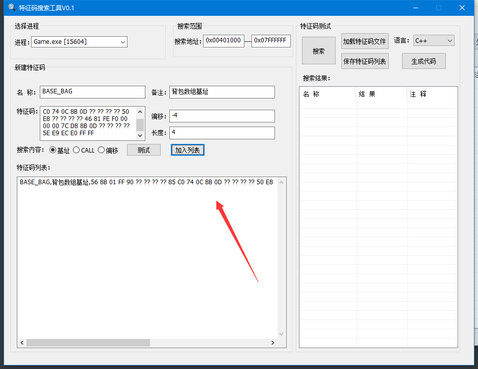
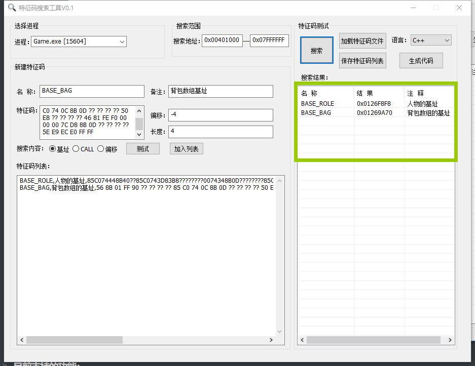
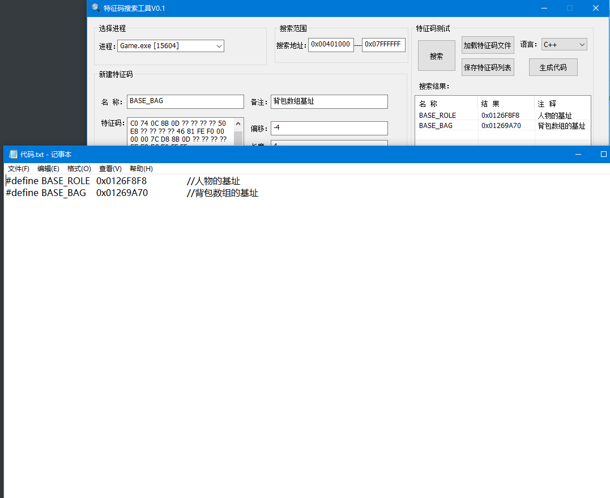

# 特征码扫描工具
在做游戏外挂的时候经常需要更新基址，为了便于更新基址我们都会把基址附近的代码提取出来做特征码，以便更新基址

本工具就是根据提取出来的特征码读取特征码指定的偏移地址的值，并可以生成响应的C++宏定义或者是易语言代码

本工具采用Sunday算法搜索特征码，支持call地址搜索

### 界面：

选择一个进程后，提取到特征码并填好相应的参数就能进行特征码测试：

参数说明：

名称：特征码的名字，生成C++代码的时候就是宏的名称

备注：生成代码时候的注释

特征码：基址附近的特征码

偏移：表面特征码距离基址的相对偏移 如果是提取基址下面的特征码这个参数就是负数，表明是往上偏移几个字节，如果是取的基址上方的特征码就填正数

长度：要读取的长度，默认是4个自己，如果是某些偏移是2个字节的话就填2

如果特征码没有取好，能读到多个的话也会有相应的提示

加入列表可以把特征码加入到下方的特征码列表中，在特征码列表的代码点击搜索按钮可以全部查找，并显示结果（如果一个特征码能匹配多个地址则只显示第一个）

点击保存按钮可以把特征码保存到文件，下次要使用这些特征码的时候可以选择加载特征码文件

当搜索结果不为空的时候可以选择生成代码，则会生成对应的C++宏定义

这样就能直接复制到C++代码中了

建议实际使用的时候名称取跟你定义的宏一样的

### 目前支持的功能：

1、测试某个特征码

2、特征码保存到文件

3、从文件中读取特征码

4、对已经有的特征码文件进行全部扫描并显示结果

5、生成对应的代码以便CV

6、指定地址扫描

### 计划支持的功能

1、生成易语言 win32汇编代码

2、进程列表显示图标

3、类似spy++拖拽到窗口选择进程

4、选择C++头文件直接替换对应的宏的基址

5、生成lua文件，如果我们C/C++代码提供了lua接口，是从lua文件中读取基址的，更新基址就不用重新编译C++代码了

6、如果特征码能扫描出多个结果，每个结果都显示出来

7、增加偏移计算接口

8、在特征码列表增加注释功能，如果注释了某一行特征码则不进行扫描

